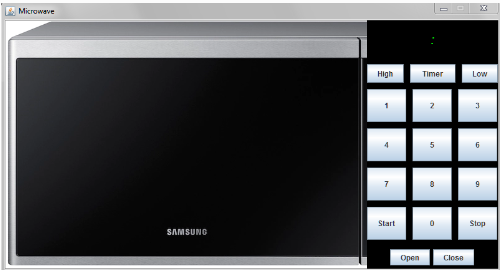
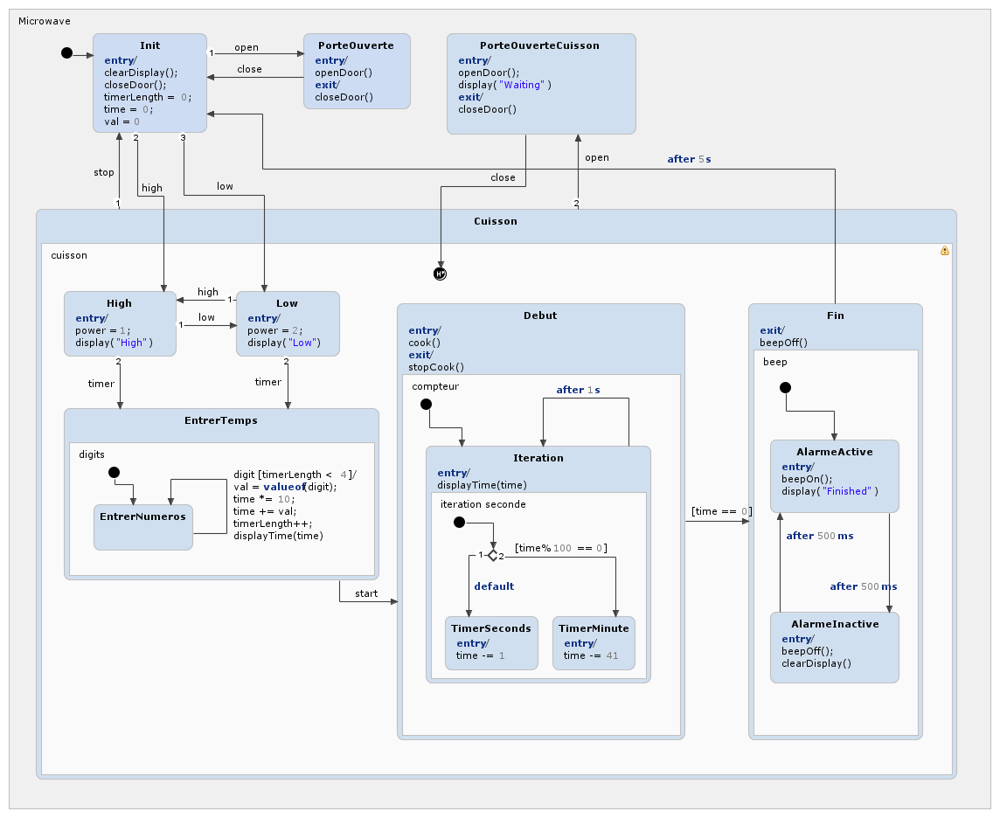

# Microwave StateChart

<pre>
  This was an assignment for the *Software analysis and design* class. 
</pre>

For this task, we were instructed to build the Statechart diagram of a working microwave using Yakindu.

  

We were given the following set of defined methods to use in our diagram :

- *beepOff()* : Dims the display
- *beepOn()* : Brightens the display and emits a sound
- *clearDisplay()* : Shows " : " on the display
- *closeDoor()* : Closes the microwave door
- *openDoor()* : Opens the microwave door
- *display(String msg)* : Shows the message *msg* on the display
- *displayTime(long t)* : Shows the cooking time on the display in "XX:XX" format
- *cook()* : Start cooking
- *stopCook()* : Stop cooking

Also, we were given the following set of buttons : 

- *High* : Indicates high power cooking, raises *high* event
- *Low* : Indicates low power cooking, raises *low* event
- *Timer* : Used to enter the cooking time, raises *timer* event
- *Start* : Starts cooking, raises *start* event
- *Stop* : Stops cooking, raises *stop* event
- *Open* : Opens the door, raises *open* event
- *Close* : Closes the door, raises *close* event
- "Digits" : Ten digits to enter time of cooking, each digit raises *digit* event

The final statechart can be found in the *Microwave* folder and looks like this :

  

